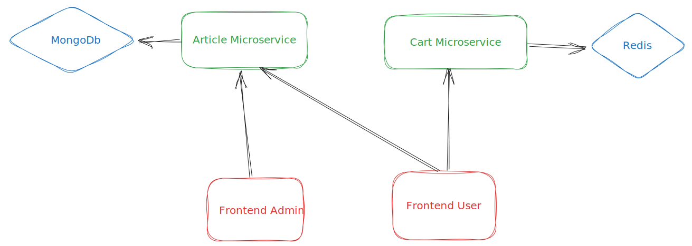

# Microservices demo

This is a sample application that demonstrates a microservice architecture.

## Architecture

The application is composed of the following microservices:
- **[article-service](./article-service)**: Golang application that manages the articles.
  - Connected to a MongoDB database.
- **[cart-service](./cart-service)**: Golang application that manages the shopping cart.
  - Connected to a Redis database.
- **[User frontend](./front-user)**: Vuejs application that serves as the frontend.
- **[Admin frontend](./front-admin)**: Vuejs application that serves as the admin frontend.
